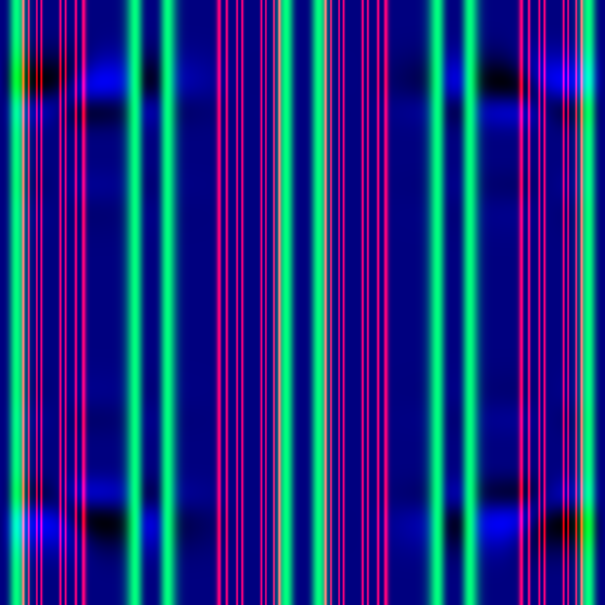
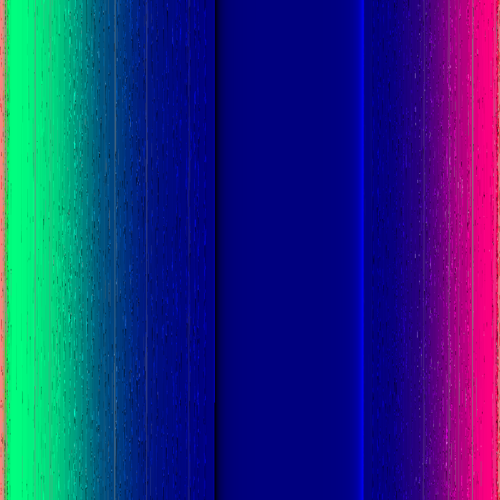
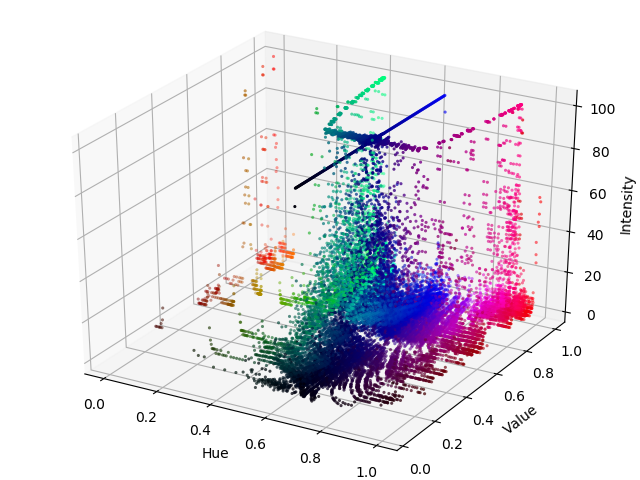
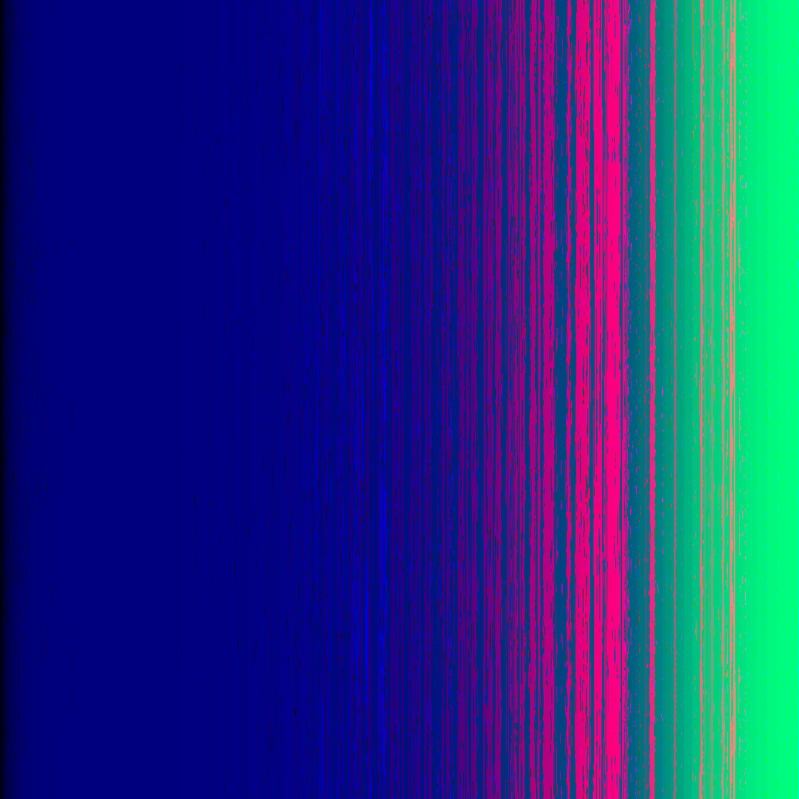

pixelsort
=========

pixelsort rearranges the pixels of an input image via sorting them by color.

</img>
</img>
</img>
</img>

<!--
</img>
</img>
</img>
</img>
-->

usage:

```console
foo@bar:~$ ./pixelsort.py <image_in> <image_out> <color_sort_algorithm>
```    

example:

```console
foo@bar:~$ ./pixelsort.py example.png test.png && feh test.png
```    

literature
----------

- [RGB Image Analysis with Python](http://marksolters.com/programming/2015/02/27/rgb-histograph.html)
- [The incredibly challenging task of sorting colours](https://www.alanzucconi.com/2015/09/30/colour-sorting/)

changelog
---------

**0.2.0**

- initial commit
